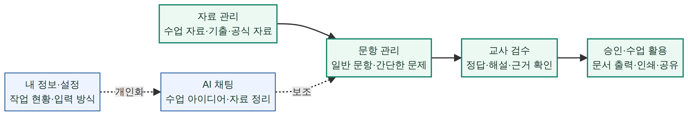

# 교사도우미 · 문제 출제 워크스페이스

**EunmaStudio**가 개발하는 교사용 자료 기반 출제 보조 서비스입니다. 교사가 교육과정, 수업 자료, 공식 안내, 기출 유형을 준비한 뒤 문항·쪽지시험을 만들고 직접 검수하여 수업과 평가에 활용할 수 있도록 돕습니다.

> 이 서비스가 만드는 결과는 **교사의 검토를 대신하지 않는 초안**입니다. 정답·해설·배점·자료 인용·저작권·실제 수업 적합성은 항상 교사가 최종 확인해야 합니다.

현재 웹은 중·고등 **과학·수학** 범위를 파일럿으로 다루며, 화학 I는 가장 먼저 검증하는 과목입니다. 향후 화학 → 과학 → 전체 교육과정 순으로 확장하되, 과목별 근거·검증·공식 자료 준비 상태를 확인한 뒤 공개합니다.

## 교사가 할 수 있는 일

| 업무 | 웹 | Windows local-only | Android 온디바이스 |
|---|---|---|---|
| 자료 준비 | 파일·링크·직접 작성, 공식 자료 원문 연결 | PC 안의 파일·SQLite 저장 | 직접 작성·파일 선택·공식 링크 |
| 문항 생성 | 관리형 AI 또는 개인 API | Ollama·llama.cpp 로컬 모델 | Gemma 4 E2B/E4B |
| 근거 확인·검수 | 근거 발췌·원본 위치·승인/수정/반려 | 로컬 검수 흐름 | 기기 내 검수·공유 중심 |
| 쪽지시험 | 객관식 4지선다·주관식·O/X 선택, **문항별** 검수, 승인 문항만 학생용 인쇄/PDF 저장 | 같은 3가지 형식의 local-only 생성·문항별 검수·승인 문항 학생용/교사용 TXT 내보내기 | 같은 3가지 형식의 온디바이스 생성·문항별 검수·승인 문항 텍스트 공유 |
| 메모장 | 계정별 메모·고정·수정·삭제 | PC 안의 메모 | 기기 안의 메모 |
| 시험일·일정 | 월간 달력에서 시험일·마감·회의·검수 계획 관리 | 이 PC의 날짜순 일정 관리·암호화 백업 포함 | 기기 안의 시험일·마감·검수 계획 관리 |
| 출력·내보내기 | DOCX·PDF·CSV, 문제집형 PDF | DOCX·PDF·CSV | DOCX·인쇄용 PDF·운영체제 공유 |
| AI 채팅 | 별도 채팅 화면은 아직 제공하지 않음 | 최근 대화·AI 제목·즐겨찾기·삭제·입력 방식·이 PC 저장 | Gemma 기반 현장형 대화·공유·이미지 질문 |

웹·Windows·Android는 같은 **업무 의미**를 지향하지만, 저장 위치와 인터페이스는 각 환경의 보안·사용성에 맞게 다릅니다. 원문 대화, 자료, API 키, 모델 파일은 플랫폼 사이에 자동으로 동기화하지 않습니다.

## 교사용 빠른 시작



> 위 그림은 화면을 대신하는 **업무 흐름 안내**입니다. 실제 메뉴 이름과 배치는 플랫폼마다 다르지만, 자료를 준비하고 문항을 만든 뒤 교사가 검수·승인한다는 핵심 과정은 같습니다.

| 순서 | 할 일 | 확인할 점 |
|---|---|---|
| 1 | 로그인 후 대시보드 또는 내 정보를 엽니다. | 자료·문항·승인·메모·쪽지시험 수와 현재 플랜을 확인합니다. |
| 1-1 | 필요하면 **시험일·일정**에 평가일·검수 마감·회의를 먼저 등록합니다. | 일정에는 제목·날짜·선택 시간·간단한 메모만 적고, 문항·자료 원문은 넣지 않습니다. |
| 2 | **자료 준비**에서 수업 자료, 평가계획, 출제 지침을 등록합니다. | PDF·이미지·텍스트·웹 링크를 사용하며, 출처와 원본 위치를 함께 확인합니다. |
| 3 | 필요하면 공식 자료 안내에서 원문을 열고 기출 유형을 등록합니다. | 기출은 공식 제공처의 이용 조건을 먼저 확인하고, 수업·검수에 필요한 범위만 직접 등록합니다. |
| 4 | **문항 생성**에서 과목·단원·유형·난이도·배점을 정합니다. | 개인 외부 AI를 선택하면 전송 범위를 확인하고 이번 요청에만 동의합니다. |
| 5 | **검수함**에서 근거·정답·해설·그래프/표·원본 위치를 검토합니다. | 일반 문항은 승인·수정 승인·반려와 검수 사유를 기록합니다. |
| 6 | **간결한 쪽지시험**에서 한 개념을 빠르게 확인할 세트를 만듭니다. | `객관식 (4지선다)`, `주관식`, `O/X` 중 하나를 고릅니다. 객관식 보기는 **`① 4`**, 정답은 **`①번`**처럼 짧고 분명하게 표시합니다. 세트 안의 **각 문항**을 `승인`, `수정 필요`, `반려`로 따로 검수합니다. 검수 대기 문항이 하나라도 있으면 세트도 검수 대기이며, 모든 문항이 승인되면 승인, 모두 반려되면 반려, 그 밖의 완료 혼합은 수정 필요로 요약합니다. 화면 상단의 **검수 대기 세트·문항 수**와 **가장 최근 미검수 생성 시각**을 먼저 확인하고, 최근 미검수 세트로 바로 이동할 수 있습니다. 개별 승인 문항은 **승인 문항 보관함**에도 일반 문항과 함께 쌓이며, 출처별 필터·검색·선택 내보내기로 관리합니다. 학생용 출력·공유에는 **승인 문항만** 들어가고 정답·해설·개념 메모는 넣지 않습니다. |
| 7 | **승인 문항**에서 출력 형식을 선택합니다. | 기본 DOCX·PDF·CSV는 유지하며, 문제집형 PDF는 교사 플러스 파일럿 기능입니다. |

## 자료·기출·출력 원칙

교사가 등록한 참고 자료와 기출은 개인 작업공간 또는 로컬 기기에 분리됩니다. 자료를 삭제하면 이후 생성에는 사용되지 않으며, 이미 만든 문항의 검수 이력에는 어떤 자료를 근거로 삼았는지 확인할 최소 근거 정보만 남습니다.

시험일·일정은 플랫폼별 개인 저장소에만 남습니다. 웹 일정은 로그인한 교사 계정 범위에만, Windows 일정은 이 PC의 암호화 백업에만, Android 일정은 앱 전용 저장소에만 보관합니다. 웹은 접속 중인 화면에서만 오늘·임박 일정을 안내하며 브라우저 푸시는 사용하지 않습니다. Windows는 교사가 켜고 앱을 실행 중인 경우에만, Android는 교사가 알림 권한을 허용한 경우에만 **일정 제목**을 기기 알림으로 표시합니다. 일정 메모·문항·자료 원문은 알림에 넣지 않으며, 외부 캘린더 동기화와 AI 요청으로의 일정 전달은 제공하지 않습니다.

일정 달력은 **일요일과 공휴일을 붉게 표시**하며, 공휴일 보기는 교사가 켜고 끌 수 있습니다. 날짜를 누르면 해당 날짜의 공휴일·저장된 일정이 먼저 보이고, 비어 있더라도 그 날짜로 바로 일정을 추가할 수 있습니다. 현재 공휴일 기본값은 2026년 관공서 공휴일·대체공휴일을 앱에 포함해 표시하므로 달력을 열 때 외부 서비스에 연결하지 않습니다. 법령·임시공휴일 변경은 다음 앱 업데이트로 반영해야 합니다.

기출문제는 서비스가 일괄 복제하거나 다른 교사에게 자동 공유하지 않습니다. 공식 제공처의 저작권·이용 조건을 확인한 뒤 직접 등록하고, 출처·연도·문항 번호·문제지 페이지를 기록해 검수 근거를 명확히 하세요. 그래프·표 문항은 실제 SVG 그래프 또는 표로 제시될 수 있으나, 축·단위·범례·수치·과학적 타당성은 반드시 검수해야 합니다.

## 플랜과 관리형 AI 파일럿

플랜은 사용자 역할과 분리된 **교사 기본**과 **교사 플러스**로 구성합니다. 현재 가격·포함량은 파일럿 검증용 안내이며, 결제·자동 플랜 변경·정기 결제는 연결되어 있지 않습니다.

| 항목 | 교사 기본 | 교사 플러스 파일럿 |
|---|---|---|
| 자료·문항·검수·메모·기본 출력·데이터 삭제 | 제공 | 제공 |
| DOCX·단순 PDF·CSV | 제공 | 제공 |
| 표지·학생 정보란·교사용 해설이 포함된 문제집형 PDF | 안내 보기 | 제공 |
| 관리형 AI 월간 성공 작업 파일럿 포함량 | 3회 | 30회 |
| Android 이미지 대화 | 안내 보기 | 파일럿 미리보기 |

관리형 AI는 문항 또는 쪽지시험이 실제로 성공해 저장된 경우에만 월간 성공 작업 수를 1회 기록합니다. 실패한 요청, 검증 재시도, 개인 API, Ollama·llama.cpp·Gemma 같은 로컬 모델은 이 포함량에 차감되지 않습니다. 관리자 역할은 문제집형 출력 권한을 가지며, 파일럿 한도는 운영 원가·품질을 확인한 뒤 변경될 수 있습니다.

## Windows에서 처음 시작하기

Windows 앱은 교사에게 모델 실행 방식이나 개발 용어를 요구하지 않습니다. 처음에는 **설정 → AI 설정 → AI 도움 기능 준비**에서 안내된 기본 도움 기능을 한 번 준비한 뒤, 문항 생성 또는 AI 채팅에서 바로 선택하면 됩니다. 선택 목록에는 **이 PC에 준비된 도움 기능만** 표시되며, 마지막 선택은 다음 채팅에도 유지됩니다.

AI 채팅을 열면 선택한 도움 기능을 미리 준비합니다. 따라서 첫 준비 중에도 질문을 작성할 수 있고, 화면에는 `모델 로딩 중 → 질문 분석 중 → 답변 생성 중`의 순서로 현재 단계를 안내합니다. 첫 대화는 질문과 답변을 바탕으로 짧은 제목을 제안하며, 제목 변경·즐겨찾기·삭제는 좌측 대화 기록에서 처리합니다. 메시지마다 처리한 도움 기능과 시각을 확인할 수 있고, **설정 → 일반 설정**에서 Enter 전송 또는 줄바꿈 방식을 바꿀 수 있습니다.

문항 생성은 `자료 확인 → 요청 정리 → 문항 작성 → 답과 해설 점검 → 검수함 저장` 상태를 보여 줍니다. 생성 결과에서는 모델의 인사·작업 안내를 분리하고 문항·보기·정답·해설·출제 의도를 읽기 좋게 배치합니다. 필요할 때에만 모델이 제공한 구조화된 표·그래프를 표시하며, 교사 자료·기출 참고·선택한 공식 자료의 근거 목록을 함께 보여 줍니다. 수치·그래프 축·정답·해설은 여전히 교사 검수가 필요합니다.

## AI 실행과 자료 보안

### 웹

웹은 별도 설정 없이 관리형 AI를 사용할 수 있고, 개인 Gemini·OpenAI 호환·Claude API를 선택할 수도 있습니다. 개인 API를 사용할 때에는 해당 요청에 사용한 과목·단원·근거 발췌·추가 조건·생성 문항이 선택한 제공자로 전송될 수 있으므로 화면의 전송 동의를 확인해야 합니다. 개인 API 키는 다시 표시하지 않으며 암호화해 저장합니다.

### Windows local-only

Windows 앱은 PC 안에서 준비한 AI 도움 기능을 사용합니다. 자료·문항·메모·대화는 이 PC의 작업 보관함에 두며, Windows 앱은 자동으로 자료를 외부 서버에 보내지 않습니다. 암호화 백업·복구는 Windows에서 제공하는 별도 기능입니다. 기술적으로는 Ollama 또는 llama.cpp를 지원하지만, 교사는 앱의 준비 안내를 따라 필요한 도움 기능만 선택하면 됩니다.

### Android 온디바이스

Android는 Gemma 4 E2B를 기본으로, E4B를 고성능 기기 선택지로 사용합니다. 모델·자료·대화는 기기 안에서 처리하며, 이미지 대화는 교사가 고른 JPEG·PNG·WEBP 한 장을 EXIF 없는 축소 임시 이미지로 처리한 뒤 성공·실패·화면 종료 때 삭제합니다. Android의 파일럿 플러스 안내는 웹 플랜과 아직 자동으로 연결되지 않습니다.

## 개인정보 최소 통계

각 교사는 자신의 자료·문항·승인·메모·쪽지시험 수를 내 정보 화면에서 볼 수 있습니다. 이 수치는 계정 또는 기기 안의 현재 작업 현황을 확인하기 위한 것이며, 다른 교사와 비교하거나 평가하는 용도로 사용하지 않습니다.

웹은 관리형 AI의 작업 종류·성공/실패·모델·응답 시간 구간 같은 **내용 없는 합계**만 운영 안정성 확인에 사용합니다. 프롬프트, 문항 원문, 파일명, 이미지, IP, 기기 식별자, 학생·교사 식별 정보는 운영 통계에 넣지 않습니다. Windows와 Android는 local-only 원칙에 따라 운영자에게 통계를 자동 전송하지 않습니다.

## 현재 검증 상태와 남은 확인

웹은 TypeScript 검사와 Vitest **85개**를 통과했습니다. Windows beta.9은 local-only 저장소·보안·대화·생성 결과 조판·일정 저장·기기 알림 예약·**문항별 쪽지시험 검수·승인 문항 필터·백업 복구** 테스트와 JavaScript 구문 검사를 통과했습니다. Android 일정·알림·문항별 쪽지시험 검수 및 승인 문항 보관함 표시는 앱 전용 저장소·앱 잠금·재부팅 뒤 재예약 경로에 추가했으나, 복구된 샌드박스에는 Android SDK가 없어 이번 Gradle 단위 테스트를 시작하지 못했습니다. 실제 운영 전에는 S25+에서 문항별 승인·수정 필요·반려, 부분 승인 세트의 학생용 공유, **승인 문항 보관함의 일반/쪽지시험 구분**, 검수 대기 수와 최근 생성 시각 표시, 정답·해설 미포함을 포함한 일정 저장·수정·삭제·알림 허용/거부·재부팅 뒤 알림·앱 잠금 재진입·이미지 대화·오프라인·문서 공유를, Windows에서 설치형 앱·AI 도움 기능 준비·연속 대화·앱 실행 중 일정 알림·일정 백업·부분 승인 학생용 TXT·승인 문항 보관함을 별도로 확인해야 합니다.

> 실제 출제 예정 문항, 학생 식별 정보, 민감한 성적 자료를 파일럿 테스트 이미지나 외부 개인 AI 요청에 사용하지 마세요.

## 개발 환경 실행

이 저장소에는 비밀 값과 배포 전용 설정을 포함하지 않습니다. 웹 로컬 개발은 데이터베이스·OAuth·저장소·관리형 AI 관련 환경값을 별도로 준비해야 하며, `.env` 파일이나 API 키는 커밋하지 않습니다.

```bash
# 웹 프로젝트
pnpm install
pnpm check
pnpm test
pnpm dev
```

데이터베이스 스키마를 변경할 때에는 `drizzle/schema.ts`를 먼저 수정하고, 아래 순서를 지킵니다. 생성된 SQL을 검토한 뒤에만 개발·운영 데이터베이스에 적용합니다.

```bash
pnpm drizzle-kit generate
# drizzle/의 새 SQL 검토 후 안전한 환경에서 적용
```

```bash
# Windows local-only 앱
cd desktop
# Node.js LTS와 pnpm이 필요합니다. PowerShell·CMD에서는 같은 명령을 사용합니다.
pnpm install
pnpm test
pnpm desktop

# Android
cd mobile-android
./gradlew testDebugUnitTest
./gradlew assembleDebug
```

## 저장소 구조

| 경로 | 역할 |
|---|---|
| `client/` | React 웹 화면과 공통 UI |
| `server/` | tRPC 라우터, AI·권한·자료 처리, DB 접근 |
| `drizzle/` | MySQL/TiDB 스키마와 검토 가능한 마이그레이션 SQL |
| `desktop/` | Electron 기반 Windows local-only 앱 |
| `mobile-android/` | Kotlin·LiteRT-LM 기반 Android 앱 |
| `docs/` | 플랫폼 기능 점검, 보안·운영·이관·출력·플랜 설계 문서 |
| `CHANGELOG.md` | 사용자 영향 변경 이력 |
| `todo.md` | 구현·검증·운영의 남은 항목 |

## 운영 전 확인 사항

파일럿을 실제 서비스로 전환하기 전에는 개인정보 처리방침, 이용약관, 자료 권리와 보존·삭제 정책, AI 제공자 약관, 문의·장애 대응 절차, 결제·환불 정책을 실제 운영 조건에 맞게 확정해야 합니다. 공식 자료는 자동 수집 즉시 반영하지 않고, 변경 감지 후 운영자 검토와 교사 고지 과정을 두는 것을 원칙으로 합니다.

추가 설계와 검토 위치는 [CHANGELOG.md](./CHANGELOG.md), [todo.md](./todo.md), [기능별 코드 검토 안내](./docs/code-review-map.md), [3플랫폼 기능 동등성 점검](./docs/platform-parity-audit-2026-08.md)에서 확인할 수 있습니다.
